# Chaos Engineering with LitmusChaos on AmazonEKS

## Introduction

Hi! 

Our topic for today's project is **Chaos Engineering with LitmusChaos on AmazonEKS.** 

Chaos Engineering is a disciplined approach companies take to identifying failures before they turn into outages. Chaos Engineering allows you to compare what you think will happen to what actually happens in your systems. You “break things on purpose” to learn how to build more resilient systems.

So, by proactively testing how a system responds under stress, we can identify and fix failures *before* they result in system downtime, or even end up in the news.

### Practicing Chaos Engineering

When preforming controlled chaos experiments, you should:

1. Start by defining *‘steady state’* as some measurable output of a system that indicates normal behavior.
2. Hypothesize that this steady state will continue in both the control group and the experimental group.
3. Introduce variables that reflect real world events like servers that crash, hard drives that malfunction, network connections that are severed, etc.
4. Attempt to invalidate the hypothesis by noting differences in behavior between control and experimental groups after chaos is introduced.

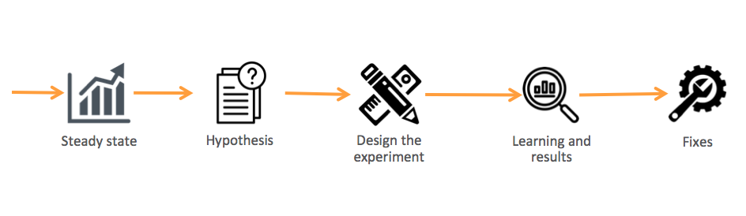

### LitmusChaos Architecture

[LitmusChaos](https://litmuschaos.io/) is the Chaos Engineering framework, intended to work with [Kubernetes](https://sdk.operatorframework.io/). We'll be using it to identify weaknesses & potential outages in our infrastructures by inducing chaos tests in a controlled way. 

Litmus takes a cloud-native approach to create, manage, and monitor chaos. Chaos is orchestrated using the following Kubernetes CRDs:

- **ChaosEngine**: A resource to link a Kubernetes application or Kubernetes node to a ChaosExperiment. ChaosEngine is watched by the Litmus ChaosOperator, which then invokes ChaosExperiments
- **ChaosExperiment**: A resource to group the configuration parameters of a chaos experiment. ChaosExperiment CRs are created by the operator when experiments are invoked by ChaosEngine.
- **ChaosResult**: A resource to hold the results of a ChaosExperiment.

## Getting Started

For this project, we'll create an Amazon Elastic Kubernetes Service(Amazon EKS) cluster with managed nodes. We’ll then install LitmusChaos and a demo application. Then, we will install chaos experiments to be run on the demo application and observe the behavior.

### Create EKS Cluster

You'll want to ensure the following systems are installed prior to beginning. Follow the following links that walk you through each installation:

- [AWS CLI version 2](https://docs.aws.amazon.com/cli/latest/userguide/install-cliv2.html)
- [eksctl](https://docs.aws.amazon.com/eks/latest/userguide/eksctl.html)
- [kubectl](https://docs.aws.amazon.com/eks/latest/userguide/install-kubectl.html)
- [Helm](https://www.eksworkshop.com/beginner/060_helm/helm_intro/install/index.html)

### Create a new EKS cluster using eksctl:

1. Once you have downloaded all the necessary requirements, run the following command: 

    $ export ACCOUNT_ID=$(aws sts get-caller-identity --output text --query Account)

Followed by:

    $ export AWS_REGION=us-east-1 #change as per your region of choice

2. Create a yaml file on your PC using the command below:

    $ touch cluster.yaml

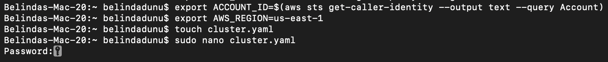

Open the cluster.yaml file using nano:

    $ sudo nano cluster.yaml

Edit the cluster.yaml file and place the following code within the file:

    ---
    apiVersion: eksctl.io/v1alpha5
    kind: ClusterConfig
    metadata:
    name: eks-litmus-demo
    region: ${AWS_REGION}
    version: "1.21"
    managedNodeGroups:
    - instanceType: m5.large
        amiFamily: AmazonLinux2
        name: eks-litmus-demo-ng
        desiredCapacity: 2
        minSize: 2
        maxSize: 4

Save, then exit.

**Note:** Make sure to substitute ${AWS_REGION} with your preferred region.

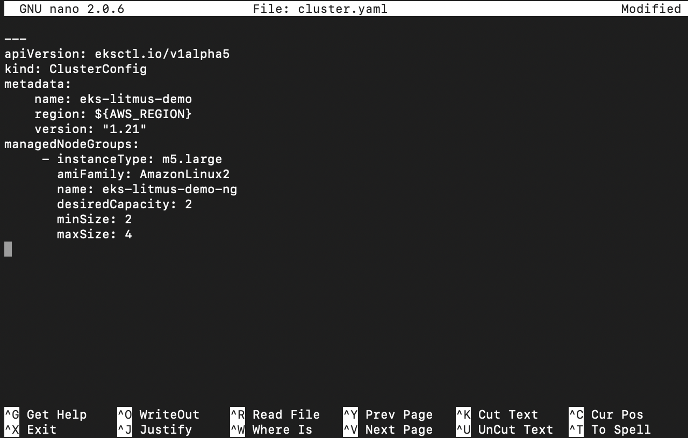

Create the cluster by running:

    $ eksctl create cluster -f cluster.yaml

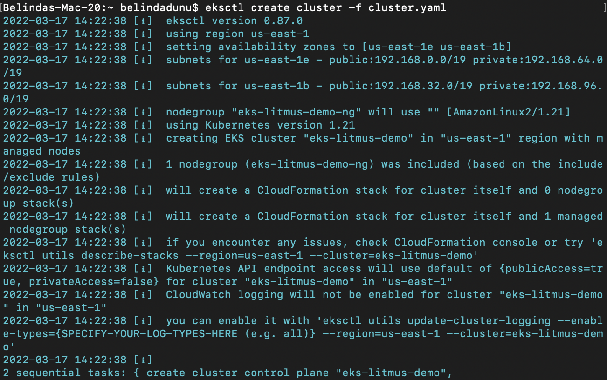

### Install Helm

Helm is a package manager and application management tool for Kubernetes that packages multiple Kubernetes resources into a single logical deployment unit called a Chart.

Helm helps you to:

- Achieve a simple (one command) and repeatable deployment
- Manage application dependency, using specific versions of other application and services
- Manage multiple deployment configurations: test, staging, production and others
- Execute post/pre deployment jobs during application deployment
Update/rollback and test application deployments

Before we can get started configuring Helm, we’ll need to first install the command line tools that you will interact with. To do this, run the following:

    $ curl -sSL https://raw.githubusercontent.com/helm/helm/master/scripts/get-helm-3 | bash

Verify Helm installation using the command below and confirm that you are using Helm version. At the time of this project, the latest version is v3.X:

    $ helm version --short

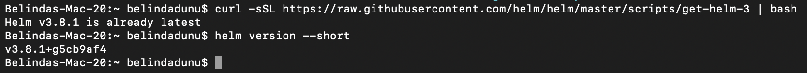

### Install LitmusChaos

Next, let's install LitmusChaos on an Amazon EKS cluster using a Helm chart. The Helm chart will install the needed CRDs, service account configuration, and ChaosCenter.

Add the Litmus Helm repository using the command below:

    $ helm repo add litmuschaos https://litmuschaos.github.io/litmus-helm/

Confirm that you have the Litmus-related Helm charts:

    $ helm search repo litmuschaos

Your output should look similar to this:

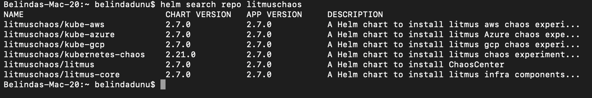

Create a namespace to install LitmusChaos:

    $ kubectl create ns litmus

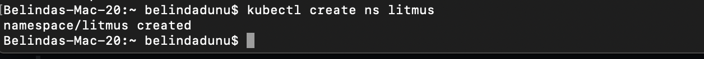

By default, Litmus Helm chart creates NodePort services. We'll need to change the backend service type to ClusterIP and front-end service type to LoadBalancer, so we can access the Litmus ChaosCenter using a load balancer.

    $ cat <<EOF > override-litmus.yaml
Enter the following immediately after:

    portal:
    server:
        service:
        type: ClusterIP
    frontend:
        service:
        type: LoadBalancer
    EOF

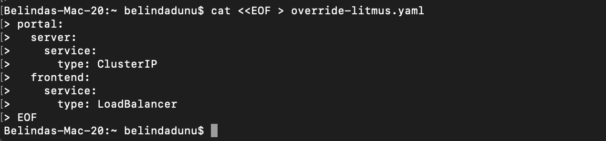

Next, run:

    $ helm install chaos litmuschaos/litmus --namespace=litmus -f override-litmus.yaml

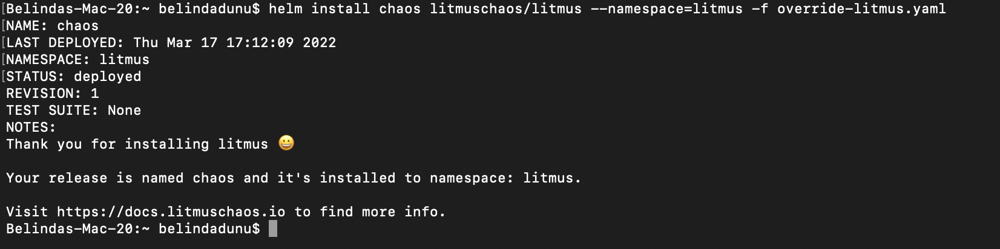

Verify that LitmusChaos is running:

    $ kubectl get pods -n litmus

You should see an output similar to the one below:

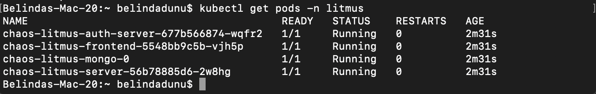

Then run:

    $ kubectl get svc -n litmus

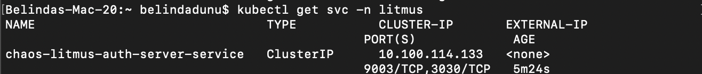

Run:

    $ export LITMUS_FRONTEND_SERVICE=`kubectl get svc chaos-litmus-frontend-service -n litmus --output jsonpath='{.status.loadBalancer.ingress[0].hostname}:{.spec.ports[0].port}'`

Then:

    $ echo "Litmus ChaosCenter is available at http://$LITMUS_FRONTEND_SERVICE"

Your output should resemble what's below:

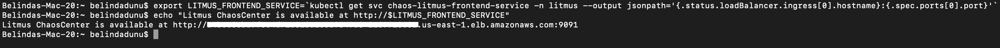

### Litmus ChaosCenter

You'll now need to access Litmus ChaosCenter UI using the URL given from the output above, and sign in with the default username “admin” and password “litmus.”

When prompted to enter a new password, you can choose to modify it, or skip momentarily.

Once you've successfully signed-in, you should see the welcome dashboard. Click on the *ChaosAgents* link from the left-hand navigation.

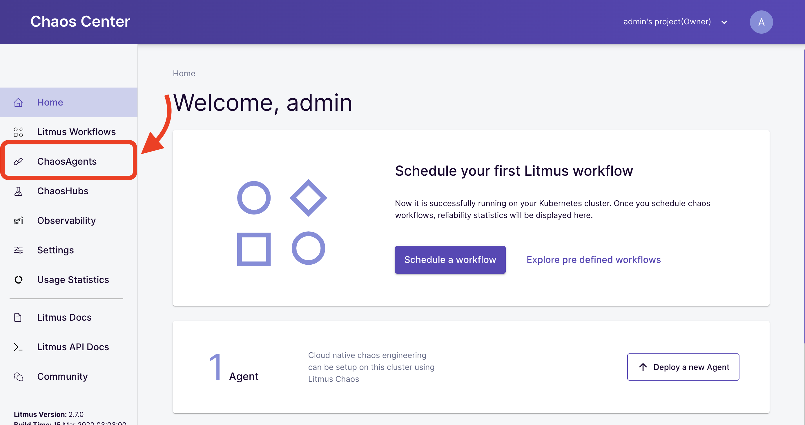

A ChaosAgent represents the target cluster where Chaos would be injected via Litmus. Confirm that Self-Agent is in Active status. 

**Note:** It may take a couple of minutes for the Self-Agent to become active.

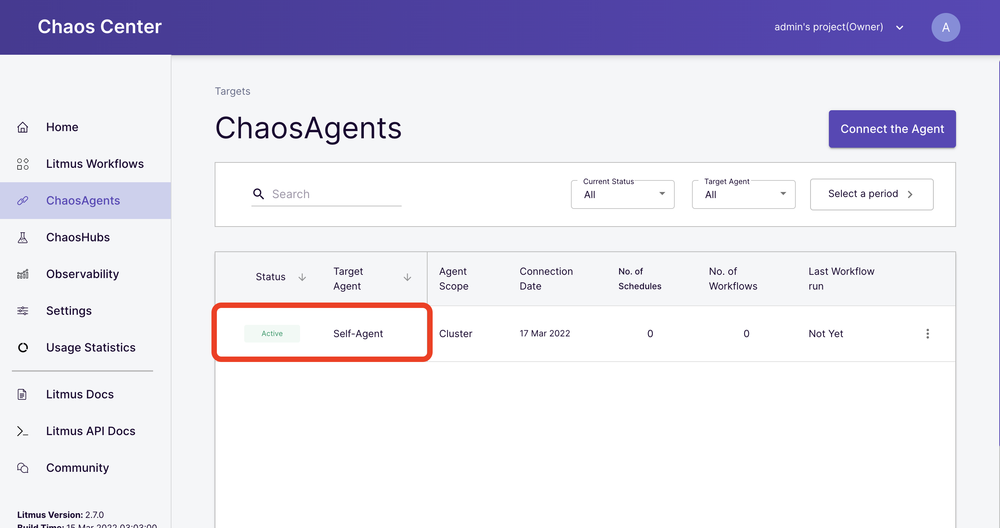

Head over to your Terminal and confirm the agent installation by running the command below:

    $ kubectl get pods -n litmus

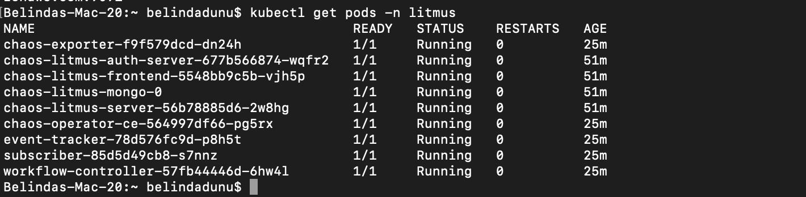

Verify that LitmusChaos CRDs are created:

    $ kubectl get crds | grep chaos

You should see a response similar to the one below showing chaosengines, chaosexperiments, and chaosresults:

Verify that LitmusChaos API resources are created:

    $ kubectl get crds | grep chaos

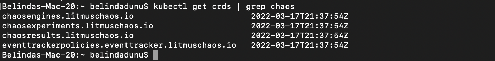

Next, verify that LitmusChaos API resources are created:

    $ kubectl api-resources | grep chaos

You should see an output similar to the one below.

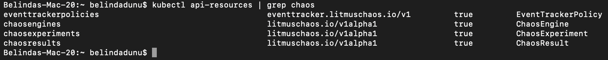

Now that we installed LitmusChaos on the EKS cluster, let’s install a demo application to perform some chaos experiments on.

### Installing demo application

We'll deploy nginx on our cluster using the manifest below to run our chaos experiments on it. Save the manifest as nginx.yaml and apply it.

    $ cat <<EOF > nginx.yaml

Next, edit nginx.yaml with the below code:

    apiVersion: apps/v1
    kind: Deployment
    metadata:
    name: nginx
    labels:
        app: nginx
    spec:
    replicas: 1
    selector:
        matchLabels:
        app: nginx
    template:
        metadata:
        labels:
            app: nginx
        spec:
        containers:
        - image: nginx
            name: nginx
            resources:
            limits:
                cpu: 500m
                memory: 512Mi
            requests:
                cpu: 500m
                memory: 512Mi
    EOF

Install the demo app by running the command below:

    $ kubectl apply -f nginx.yaml

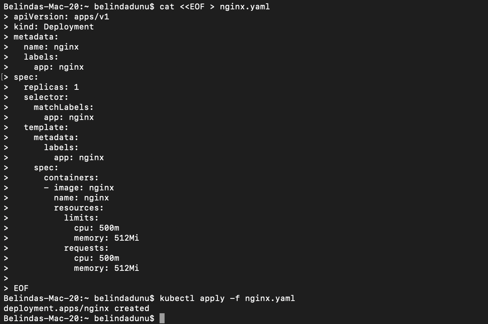

Verify if the nginx pod is running: 

    $ kubectl get pods

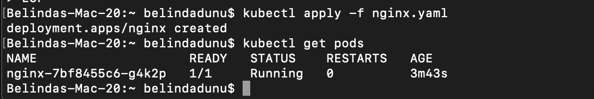

