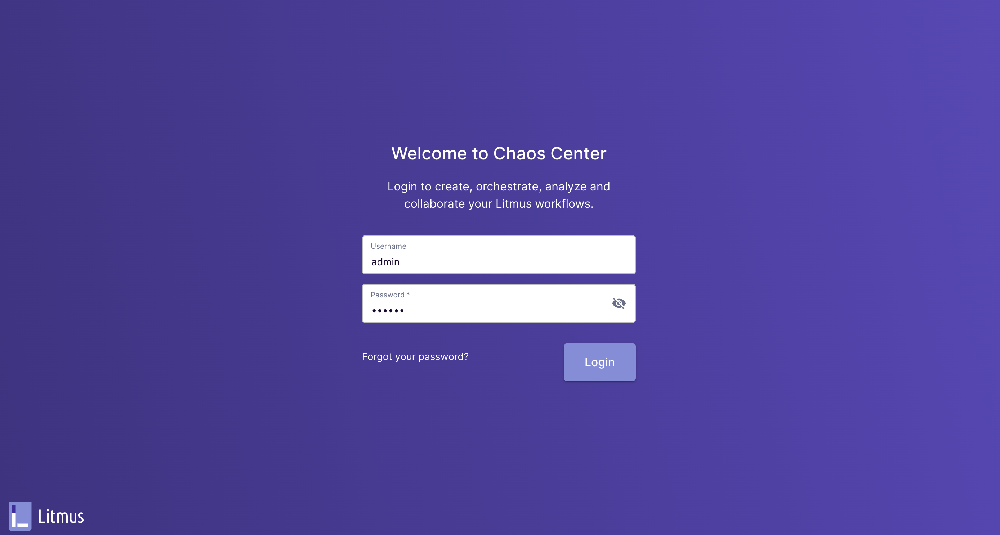
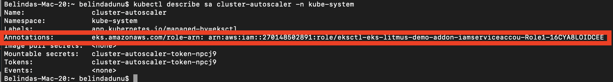
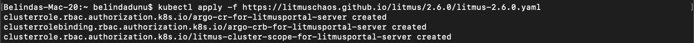
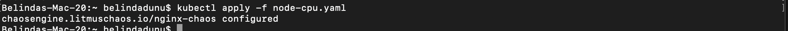

# Chaos Engineering with LitmusChaos on AmazonEKS

## Introduction

Hello! In this project, we'll be diving into **Chaos Engineering using LitmusChaos on AmazonEKS.** 

Chaos engineering or chaos testing is a technique that simulates unexpected system failures to test a system's behavior and recovery plan. Based on what they learn from these tests, organizations design interventions and upgrades to strengthen their technology.

So, by proactively testing how a system responds under stress, we can identify and fix failures *before* they result in application crashes, network latency, etc.

### Practicing Chaos Engineering

When preforming controlled chaos experiments, you should:

1. Start by defining *‘steady state’* as some measurable output of a system that indicates normal behavior.
2. Hypothesize that this steady state will continue in both the control group and the experimental group.
3. Introduce variables that reflect real world events like servers that crash, hard drives that malfunction, network connections that are severed, etc.
4. Attempt to invalidate the hypothesis by noting differences in behavior between control and experimental groups after chaos is introduced.

### LitmusChaos Architecture

[LitmusChaos](https://litmuschaos.io/) is the Chaos Engineering framework, intended to work with [Kubernetes](https://sdk.operatorframework.io/). We'll be using it to identify weaknesses & potential outages in our infrastructures by inducing chaos tests in a controlled way. 

Litmus takes a cloud-native approach to create, manage, and monitor chaos. Chaos is orchestrated using the following Kubernetes [custom resource definitions](https://kubernetes.io/docs/concepts/extend-kubernetes/api-extension/custom-resources/) (CRDs):

- **ChaosEngine**: A resource to link a Kubernetes application or Kubernetes node to a ChaosExperiment. ChaosEngine is watched by the Litmus ChaosOperator, which then invokes ChaosExperiments
- **ChaosExperiment**: A resource to group the configuration parameters of a chaos experiment. ChaosExperiment CRs are created by the operator when experiments are invoked by ChaosEngine.
- **ChaosResult**: A resource to hold the results of a ChaosExperiment.

## Getting Started

For this project, we'll create an Amazon Elastic Kubernetes Service(Amazon EKS) cluster with managed nodes. We’ll then install LitmusChaos and a demo application. Then, we will install chaos experiments to be run on the demo application and observe the behavior.

### Create EKS Cluster

You'll want to ensure the following systems are installed prior to beginning. Follow the following links that walk you through each installation:

- [AWS CLI version 2](https://docs.aws.amazon.com/cli/latest/userguide/install-cliv2.html)
- [eksctl](https://docs.aws.amazon.com/eks/latest/userguide/eksctl.html)
- [kubectl](https://docs.aws.amazon.com/eks/latest/userguide/install-kubectl.html)
- [Helm](https://www.eksworkshop.com/beginner/060_helm/helm_intro/install/index.html)

### Create a new EKS cluster using eksctl:

Once you have downloaded all the necessary requirements, run the following command:

    $ export ACCOUNT_ID=$(aws sts get-caller-identity --output text --query Account)

    $ export AWS_REGION=us-east-2 #change as per your region of choice

Followed by:

    $ export AWS_REGION=us-east-1 #change as per your region of choice

Create a yaml file on your PC using the command below:

    $ touch cluster.yaml

Open the cluster.yaml file using nano:

    $ sudo nano cluster.yaml

Edit the cluster.yaml file and place the following code within the file:

    ---
    apiVersion: eksctl.io/v1alpha5
    kind: ClusterConfig
    metadata:
        name: eks-litmus-demo
        region: ${AWS_REGION}
        version: "1.21"
    managedNodeGroups:
        - instanceType: m5.large
          amiFamily: AmazonLinux2
          name: eks-litmus-demo-ng
          desiredCapacity: 2
          minSize: 2
          maxSize: 4

Save, then exit.

**Note:** Make sure to substitute ${AWS_REGION} with your preferred region.

Create the cluster by running:

    $ eksctl create cluster -f cluster.yaml

### Install Helm

Helm is a package manager and application management tool for Kubernetes that packages multiple Kubernetes resources into a single logical deployment unit called a Chart.

Helm helps you to:

- Achieve a simple (one command) and repeatable deployment
- Manage application dependency, using specific versions of other application and services
- Manage multiple deployment configurations: test, staging, production and others
- Execute post/pre deployment jobs during application deployment
- Update/rollback and test application deployments

Before we can get started configuring Helm, we’ll need to first install the command line tools that you will interact with. To do this, run the following:

    $ curl -sSL https://raw.githubusercontent.com/helm/helm/master/scripts/get-helm-3 | bash

Verify Helm installation using the command below and confirm that you are using Helm version. At the time of this project, the latest version is v3.X:

    $ helm version --short

### Install LitmusChaos

Next, let's install LitmusChaos on an Amazon EKS cluster using a Helm chart. The Helm chart will install the needed CRDs, service account configuration, and ChaosCenter.

Add the Litmus Helm repository using the command below:

    $ helm repo add litmuschaos https://litmuschaos.github.io/litmus-helm/

Confirm that you have the Litmus-related Helm charts:

    $ helm search repo litmuschaos

Your output should look similar to this:

Create a namespace to install LitmusChaos:

    $ kubectl create ns litmus

By default, Litmus Helm chart creates NodePort services. We'll need to change the backend service type to ClusterIP and front-end service type to LoadBalancer, so we can access the Litmus ChaosCenter using a load balancer.

Create a file named override-litmus.yaml, by running:

    $ touch override-litmus.yaml

Now edit the *override-litmus.yaml* file and place the below code in it.:

    $ sudo nano override-litmus.yaml

    portal:
      server:
        service:
          type: ClusterIP
      frontend:
        service:
          type: LoadBalancer
    EOF

Next, run:

    $ helm install chaos litmuschaos/litmus --namespace=litmus -f override-litmus.yaml

Verify that LitmusChaos is running:

    $ kubectl get pods -n litmus

You should see an output similar to the one below:

Then run:

    $ kubectl get svc -n litmus

Run:

    $ export LITMUS_FRONTEND_SERVICE=`kubectl get svc chaos-litmus-frontend-service -n litmus --output jsonpath='{.status.loadBalancer.ingress[0].hostname}:{.spec.ports[0].port}'`

Then:

    $ echo "Litmus ChaosCenter is available at http://$LITMUS_FRONTEND_SERVICE"

Your output should resemble what's below:

### Litmus ChaosCenter

You'll now need to access Litmus ChaosCenter UI using the URL given from the output above, and sign in with the default username “admin” and password “litmus.”

When prompted to enter a new password, you can choose to modify it, or skip momentarily.

Once you've successfully signed-in, you should see the welcome dashboard. Click on the *ChaosAgents* link from the left-hand navigation.

A ChaosAgent represents the target cluster where Chaos would be injected via Litmus. Confirm that Self-Agent is in Active status. 

**Note:** It may take a couple of minutes for the Self-Agent to become active.

Head over to your Terminal and confirm the agent installation by running the command below:

    $ kubectl get pods -n litmus

Verify that LitmusChaos CRDs are created:

    $ kubectl get crds | grep chaos

You should see a response similar to the one below showing chaosengines, chaosexperiments, and chaosresults:

Verify that LitmusChaos API resources are created:

    $ kubectl get crds | grep chaos

Next, verify that LitmusChaos API resources are created:

    $ kubectl api-resources | grep chaos

You should see an output similar to the one below.

Now that we installed LitmusChaos on the EKS cluster, let’s install a demo application to perform some chaos experiments on!

### Installing demo application

We'll deploy nginx on our cluster using the manifest below to run our chaos experiments on it. Save the manifest as nginx.yaml and apply it.

Create a file on your PC and name it nginx.yaml:

    $ touch nginx.yaml

Next, edit nginx.yaml with the below code:

    $ sudo nano nginx.yaml

Enter:

    apiVersion: apps/v1
    kind: Deployment
    metadata:
    name: nginx
    labels:
        app: nginx
    spec:
    replicas: 1
    selector:
        matchLabels:
        app: nginx
    template:
        metadata:
        labels:
            app: nginx
        spec:
        containers:
        - image: nginx
            name: nginx
            resources:
            limits:
                cpu: 500m
                memory: 512Mi
            requests:
                cpu: 500m
                memory: 512Mi
    EOF

Install the demo app by running the command below:

    $ kubectl apply -f nginx.yaml

Verify if the nginx pod is running: 

    $ kubectl get pods

## Chaos Experiments

[Litmus ChaosHub](https://hub.litmuschaos.io/) is a public repository where LitmusChaos community members publish their chaos experiments such as pod-delete, node-drain, node-cpu-hog, etc. In this demo walkthrough, we'll perform the pod-autoscaler experiment from LitmusChaos hub to test cluster auto scaling on Amazon EKS cluster.

### Experiment: Pod Autoscaler

The purpose of this pod auto scaler experiment is to check the ability of nodes to accomodate the number of replicas for a deployment. Plus, the experiment can also be used to check the cluster auto-scaling feature.

**Our Hypothesis:** Amazon EKS cluster should auto scale when cluster capacity is insufficient to run the pods.

Chaos experiment can be launched using the Litmus ChaosCenter UI by creating a workflow.

Navigate to Litmus Chaos Center and select **Litmus Workflows** in the left-hand navigation and then select the **Schedule a workflow** button to create a workflow.

Select the Self-Agent radio button on the Schedule a new Litmus workflow page and select **Next.**

Select the **Self-Agent** radio button on the Schedule a new Litmus workflow page and select **Next.**

Choose **Create a new workflow using the experiments from ChaosHubs** and leave the **Litmus ChaosHub** selected from the dropdown.

Now enter a name for your workflow on the next screen, then select **Next.**

In the next step let's add the experiments. Select **Add a new experiment**; then search for autoscaler and select the **generic/pod-autoscaler** radio button.

We'll edit the experiment and change some parameters. Choose the Edit icon:

Accept the default values in the **General**, **Target Application**, and **Define the steady state for this application** sections. 

In the **Tune Experiment** section, set the **TOTAL_CHAOS_DURATION** to 180 and **REPLICA_COUNT** to 10.

*TOTAL_CHAOS_DURATION* sets the desired chaos duration in seconds and *REPLICA_COUNT* is the number of replicas to scale during the experiment. Select **Finish.**

Then, choose **Next** and accept the defaults for **reliability score** and schedule the experiment to *run now*. Lastly, select **Finish** to run the chaos experiment.

We have successfully created a new Litmus workflow!

Our chaos experiment is now scheduled to run and we can look at the status by clicking on the workflow.

From the ChaosResults, we can see that the experiment failed because there was no capacity in the cluster to run 10 replicas.

### Install Cluster Autoscaler

Cluster Autoscaler is a tool that automatically adjusts the size of the Kubernetes cluster based on the utilization of Pods and Nodes in your cluster Cluster Autoscaler will attempt to determine the CPU, memory, and GPU resources provided by an Auto Scaling group based on the instance type specified in its launch configuration or launch template.

Let's create an IAM OIDC identity provider for our cluster with the following command: 

    $ eksctl utils associate-iam-oidc-provider --cluster eks-litmus-demo --approve

### Create an IAM policy and role

We'll need to create an IAM policy that grants the permissions that the Cluster Autoscaler requires to use an IAM role.

    $ cat <<EOF > cluster-autoscaler-policy.json

**Note:** If the command above does not work for you, attempt to use the command below. Enter your password if/when prompted.

    $ sudo nano cluster-autoscaler-policy.json

Paste the following into the policy:

    { 
        "Version": "2012-10-17", 
        "Statement": [
            {
                "Action": [
                "autoscaling:DescribeAutoScalingGroups", "autoscaling:DescribeAutoScalingInstances", "autoscaling:DescribeLaunchConfigurations", "autoscaling:DescribeTags", "autoscaling:SetDesiredCapacity", "autoscaling:TerminateInstanceInAutoScalingGroup", "ec2:DescribeLaunchTemplateVersions" 
                ], 
                "Resource": "*", 
                "Effect": "Allow" 
            } 
        ] 
    } 
    EOF

Once the above has been pasted, run the following command:

    $ aws iam create-policy \ 
    --policy-name AmazonEKSClusterAutoscalerPolicy \ 
    --policy-document file://cluster-autoscaler-policy.json

Using *eksctl*, we'll create an IAM role and attach an IAM policy to it.

    $ eksctl create iamserviceaccount \
    --cluster=eks-litmus-demo \
    --namespace=kube-system \
    --name=cluster-autoscaler \
    --attach-policy-arn="arn:aws:iam::$ACCOUNT_ID:policy/<AmazonEKSClusterAutoscalerPolicy>" \
    --override-existing-serviceaccounts \
    --approve

**Note:** Your policy arn can be located in your IAM console, when you click on the policy.

Ensure your service account with the ARN of the IAM role is annotated.

    $ kubectl describe sa cluster-autoscaler -n kube-system

### Deploy the Cluster Autoscaler

Download the Cluster Autoscaler manifest: 

    $ curl -o cluster-autoscaler-autodiscover.yaml https://raw.githubusercontent.com/kubernetes/autoscaler/master/cluster-autoscaler/cloudprovider/aws/examples/cluster-autoscaler-autodiscover.yaml

With *nano*, edit the downloaded file to replace <YOUR CLUSTER NAME> with the cluster name *(eks-litmus-demo)*.

    $ sudo nano cluster-autoscaler-autodiscover.yaml

Add the following two lines:

    --balance-similar-node-groups

    --skip-nodes-with-system-pods=false

Save, then exit. The edited manifest section should look like the following:

Apply the manifest file to the cluster.

    $ kubectl apply -f cluster-autoscaler-autodiscover.yaml

We'll now patch the deployment to add the *cluster-autoscaler.kubernetes.io/safe-to-evict* annotation to the Cluster Autoscaler pods:

    $ kubectl patch deployment cluster-autoscaler \
    -n kube-system \
    -p '{"spec":{"template":{"metadata":{"annotations":{"cluster-autoscaler.kubernetes.io/safe-to-evict": "false"}}}}}'

Next, find the latest Cluster Autoscaler version that matches the Kubernetes major and minor versions of our cluster. 

For example, if the Kubernetes version of our cluster is 1.21, find the latest Cluster Autoscaler release that begins with 1.21. Record the semantic version number (1.21.n) for that release to use in the next step.

Run:
    $ export K8S_VERSION=$(kubectl version --short | grep 'Server Version:' | sed 's/[^0-9.]*\([0-9.]*\).*/\1/' | cut -d. -f1,2)

Then:
    $ export AUTOSCALER_VERSION=$(curl -s "https://api.github.com/repos/kubernetes/autoscaler/releases" | grep '"tag_name":' | grep -m1 ${K8S_VERSION} | sed 's/[^0-9.]*\([0-9.]*\).*/\1/')

Set the Cluster Autoscaler image tag to the version that was exported in the previous step with the following command.

    $ kubectl set image deployment cluster-autoscaler \
    -n kube-system \
    cluster-autoscaler=k8s.gcr.io/autoscaling/cluster-autoscaler:${AUTOSCALER_VERSION}

After you have deployed the Cluster Autoscaler, you can view the logs and verify that it’s monitoring your cluster load.

View your Cluster Autoscaler logs with the following command:

    $ kubectl -n kube-system logs -f deployment.apps/cluster-autoscaler

Now that we have deployed the Cluster Autoscaler, let’s rerun the same experiment by navigating to *Litmus Workflows*, then the *Schedules* tab. Select the three dots menu icon for the workflow and select **Rerun Schedule.**

This time, the Cluster Autoscaler will add additional nodes to the cluster, and the experiment will pass, proving our hypothesis!

**Experiment Conclusion**

Due to insufficient capacity, autoscaling the pod activated the ClusterAutoscaler. This caused a new node to be added to the cluster, thereby successfully provisoning the pods.

### Next Steps

With our project above, we were able to develop experience with Chaos Engineering, using LitmusChaos on Amazon EKS. There are additional experiments such as [pod-delete](https://hub.litmuschaos.io/generic/pod-delete), [node-drain](https://hub.litmuschaos.io/generic/node-drain), [node-cpu-hog](https://hub.litmuschaos.io/generic/node-cpu-hog), etc. that we can integrate with a CI/CD pipeline to perform Chaos Engineering. LitmusChaos also supports [gitops](https://docs.litmuschaos.io/docs/concepts/gitops) and advanced chaos workflows using [Chaos Workflows](https://docs.litmuschaos.io/docs/concepts/chaos-workflow).

### Pod-Delete

Pod delete contains chaos to disrupt state of kubernetes resources. Experiments can inject random pod delete failures against specified applications. Doing so would:

- Cause (forced/graceful) pod failure of random replicas of an application deployment.
- Test deployment sanity (replica availability & uninterrupted service) and recovery workflows of the application pod.

### Getting Started:

**Install Litmus Operator**: a tool for injecting Chaos Experiments

## Installation

When installing Litmus, first-time  users presently have two options. The first is using a hosted Litmus service like [ChaosNative Litmus Cloud](https://cloud.chaosnative.com/). Alternatively, users looking for some more flexibility can install Litmus into their own Kubernetes cluster.

Users choosing the self-hosted option can refer to our Install and Configure docs for installing alternate versions and more detailed instructions.

- Self-Hosted
- Hosted (Beta)

Installation of Self-Hosted Litmus can be done using either of the methods below:

 **[Helm3](https://docs.litmuschaos.io/docs/getting-started/installation/#install-litmus-using-helm)** chart 
 
 **[Kubectl](https://docs.litmuschaos.io/docs/getting-started/installation/#install-litmus-using-kubectl)** yaml spec file.

Below are the details for Self-Hosted Litmus installation.
### Install Litmus using Helm

The helm chart will install all the required service account configuration and ChaosCenter.

The following steps will help us install Litmus ChaosCenter via helm.

**Add the litmus helm repository**

    $ helm repo add litmuschaos https://litmuschaos.github.io/litmus-helm/helm

    $ helm repo list

**Create the namespace on which you want to install Litmus ChaosCenter**

The ChaosCenter can be placed in any namespace, but for this scenario we are using litmus as the namespace.

    $ kubectl create ns litmus

**Install Litmus ChaosCenter**

    $ helm install chaos litmuschaos/litmus --namespace=litmus

> **Note**: Litmus uses Kubernetes CRDs to define chaos intent. Helm3 handles CRDs better than Helm2. Before running a chaos experiment, verify if Litmus is installed correctly.

### Install Litmus using kubectl

**Install Litmus ChaosCenter**

Applying the manifest file will install all the required service account configuration and ChaosCenter.

    $ kubectl apply -f https://litmuschaos.github.io/litmus/2.6.0/litmus-2.6.0.yaml

Check the services running in the namespace where you installed Litmus:

kubectl get svc -n litmus

Check the services running in the namespace where you installed Litmus:

    $  kubectl get svc -n litmus

### Accessing the ChaosCenter

To setup and login to ChaosCenter expand the available services just created and copy the **PORT** of the **litmusportal-frontend-service** service

    $ kubectl get svc -n litmus

Once you have the PORT copied in your clipboard, simply use your IP and PORT in this manner <NODEIP>:<PORT> to access the Litmus ChaosCenter.

As we have already created and accessed the Litmus ChaosCenter for our prior project, we can just navigate back to the page.

### Verify Successful Registration of the Self Agent

Once the project is created, the cluster is automatically registered as a chaos target via installation of ChaosAgents. This is represented as Self-Agent in ChaosCenter.

    $ kubectl get pods -n litmus

### Install this Chaos Experiment

You can install the Chaos Experiment running the following command:

    $ kubectl apply -f https://hub.litmuschaos.io/api/chaos/2.6.0?file=charts/generic/pod-delete/experiment.yaml

If customization or a download of the yaml is required, you can use  the code below:

    apiVersion: litmuschaos.io/v1alpha1
    description:
    message: |
        Deletes a pod belonging to a deployment/statefulset/daemonset
    kind: ChaosExperiment
    metadata:
    name: pod-delete
    labels:
        name: pod-delete
        app.kubernetes.io/part-of: litmus
        app.kubernetes.io/component: chaosexperiment
        app.kubernetes.io/version: 2.6.0
    spec:
    definition:
        scope: Namespaced
        permissions:
        # Create and monitor the experiment & helper pods
        - apiGroups: [""]
            resources: ["pods"]
            verbs: ["create","delete","get","list","patch","update", "deletecollection"]
        # Performs CRUD operations on the events inside chaosengine and chaosresult
        - apiGroups: [""]
            resources: ["events"]
            verbs: ["create","get","list","patch","update"]
        # Fetch configmaps details and mount it to the experiment pod (if specified)
        - apiGroups: [""]
            resources: ["configmaps"]
            verbs: ["get","list",]
        # Track and get the runner, experiment, and helper pods log 
        - apiGroups: [""]
            resources: ["pods/log"]
            verbs: ["get","list","watch"]  
        # for creating and managing to execute comands inside target container
        - apiGroups: [""]
            resources: ["pods/exec"]
            verbs: ["get","list","create"]
        # deriving the parent/owner details of the pod(if parent is anyof {deployment, statefulset, daemonsets})
        - apiGroups: ["apps"]
            resources: ["deployments","statefulsets","replicasets", "daemonsets"]
            verbs: ["list","get"]
        # deriving the parent/owner details of the pod(if parent is deploymentConfig)  
        - apiGroups: ["apps.openshift.io"]
            resources: ["deploymentconfigs"]
            verbs: ["list","get"]
        # deriving the parent/owner details of the pod(if parent is deploymentConfig)
        - apiGroups: [""]
            resources: ["replicationcontrollers"]
            verbs: ["get","list"]
        # deriving the parent/owner details of the pod(if parent is argo-rollouts)
        - apiGroups: ["argoproj.io"]
            resources: ["rollouts"]
            verbs: ["list","get"]
        # for configuring and monitor the experiment job by the chaos-runner pod
        - apiGroups: ["batch"]
            resources: ["jobs"]
            verbs: ["create","list","get","delete","deletecollection"]
        # for creation, status polling and deletion of litmus chaos resources used within a chaos workflow
        - apiGroups: ["litmuschaos.io"]
            resources: ["chaosengines","chaosexperiments","chaosresults"]
            verbs: ["create","list","get","patch","update","delete"]
        image: "litmuschaos/go-runner:2.6.0"
        imagePullPolicy: Always
        args:
        - -c
        - ./experiments -name pod-delete
        command:
        - /bin/bash
        env:

        - name: TOTAL_CHAOS_DURATION
        value: '15'

        # Period to wait before and after injection of chaos in sec
        - name: RAMP_TIME
        value: ''

        - name: FORCE
        value: 'true'

        - name: CHAOS_INTERVAL
        value: '5'

        ## percentage of total pods to target
        - name: PODS_AFFECTED_PERC
        value: ''

        - name: LIB
        value: 'litmus'    

        - name: TARGET_PODS
        value: ''

        ## it defines the sequence of chaos execution for multiple target pods
        ## supported values: serial, parallel
        - name: SEQUENCE
        value: 'parallel'
        
        labels:
        name: pod-delete
        app.kubernetes.io/part-of: litmus
        app.kubernetes.io/component: experiment-job
        app.kubernetes.io/version: 2.6.0

### Setup Service Account (RBAC)

Create a service account using the following command:

    $ kubectl apply -f https://hub.litmuschaos.io/api/chaos/2.6.0?file=charts/generic/pod-delete/rbac.yaml

If customization or a download of the yaml is required, you can use  the code below:

    ---
    apiVersion: v1
    kind: ServiceAccount
    metadata:
    name: pod-delete-sa
    namespace: default
    labels:
        name: pod-delete-sa
        app.kubernetes.io/part-of: litmus
    ---
    apiVersion: rbac.authorization.k8s.io/v1
    kind: Role
    metadata:
    name: pod-delete-sa
    namespace: default
    labels:
        name: pod-delete-sa
        app.kubernetes.io/part-of: litmus
    rules:
    # Create and monitor the experiment & helper pods
    - apiGroups: [""]
        resources: ["pods"]
        verbs: ["create","delete","get","list","patch","update", "deletecollection"]
    # Performs CRUD operations on the events inside chaosengine and chaosresult
    - apiGroups: [""]
        resources: ["events"]
        verbs: ["create","get","list","patch","update"]
    # Fetch configmaps details and mount it to the experiment pod (if specified)
    - apiGroups: [""]
        resources: ["configmaps"]
        verbs: ["get","list",]
    # Track and get the runner, experiment, and helper pods log 
    - apiGroups: [""]
        resources: ["pods/log"]
        verbs: ["get","list","watch"]  
    # for creating and managing to execute comands inside target container
    - apiGroups: [""]
        resources: ["pods/exec"]
        verbs: ["get","list","create"]
    # deriving the parent/owner details of the pod(if parent is anyof {deployment, statefulset, daemonsets})
    - apiGroups: ["apps"]
        resources: ["deployments","statefulsets","replicasets", "daemonsets"]
        verbs: ["list","get"]
    # deriving the parent/owner details of the pod(if parent is deploymentConfig)  
    - apiGroups: ["apps.openshift.io"]
        resources: ["deploymentconfigs"]
        verbs: ["list","get"]
    # deriving the parent/owner details of the pod(if parent is deploymentConfig)
    - apiGroups: [""]
        resources: ["replicationcontrollers"]
        verbs: ["get","list"]
    # deriving the parent/owner details of the pod(if parent is argo-rollouts)
    - apiGroups: ["argoproj.io"]
        resources: ["rollouts"]
        verbs: ["list","get"]
    # for configuring and monitor the experiment job by the chaos-runner pod
    - apiGroups: ["batch"]
        resources: ["jobs"]
        verbs: ["create","list","get","delete","deletecollection"]
    # for creation, status polling and deletion of litmus chaos resources used within a chaos workflow
    - apiGroups: ["litmuschaos.io"]
        resources: ["chaosengines","chaosexperiments","chaosresults"]
        verbs: ["create","list","get","patch","update","delete"]
    ---
    apiVersion: rbac.authorization.k8s.io/v1
    kind: RoleBinding
    metadata:
    name: pod-delete-sa
    namespace: default
    labels:
        name: pod-delete-sa
        app.kubernetes.io/part-of: litmus
    roleRef:
    apiGroup: rbac.authorization.k8s.io
    kind: Role
    name: pod-delete-sa
    subjects:
    - kind: ServiceAccount
    name: pod-delete-sa
    namespace: default

### Sample Chaos Engine

Create a file and name it **engine.yaml**

    $ touch engine.yaml

    $ sudo nano engine.yaml

Place the below code in the **engine.yaml** file

    apiVersion: litmuschaos.io/v1alpha1
    kind: ChaosEngine
    metadata:
    name: nginx-chaos
    namespace: default
    spec:
    appinfo:
        appns: 'default'
        applabel: 'app=nginx'
        appkind: 'deployment'
    # It can be active/stop
    engineState: 'active'
    chaosServiceAccount: pod-delete-sa
    experiments:
        - name: pod-delete
        spec:
            components:
            env:
                # set chaos duration (in sec) as desired
                - name: TOTAL_CHAOS_DURATION
                value: '30'

                # set chaos interval (in sec) as desired
                - name: CHAOS_INTERVAL
                value: '10'
                
                # pod failures without '--force' & default terminationGracePeriodSeconds
                - name: FORCE
                value: 'false'

                ## percentage of total pods to target
                - name: PODS_AFFECTED_PERC
                value: ''

Once you download the yaml, apply the yaml using this command:

    $ kubectl apply -f engine.yaml

## Node-drain

Node draining is the mechanism that allows users to gracefully move all containers from one node to the other ones. 

**Getting Started:**

**Install Litmus Operator**: a tool for injecting Chaos Experiments

**Install this Chaos Experiment**

You can install the Chaos Experiment using the following command: 

    $ kubectl apply -f https://hub.litmuschaos.io/api/chaos/2.6.0?file=charts/generic/node-drain/experiment.yaml

If customization or a download of the yaml is required, you can use  the code below:

    ---
    apiVersion: litmuschaos.io/v1alpha1
    description:
    message: |
        Drain the node where application pod is scheduled
    kind: ChaosExperiment
    metadata:
    name: node-drain
    labels:
        name: node-drain
        app.kubernetes.io/part-of: litmus
        app.kubernetes.io/component: chaosexperiment
        app.kubernetes.io/version: 2.6.0
    spec:
    definition:
        scope: Cluster
        permissions:
        # Create and monitor the experiment & helper pods
        - apiGroups: [""]
            resources: ["pods"]
            verbs: ["create","delete","get","list","patch","update", "deletecollection"]
        # Performs CRUD operations on the events inside chaosengine and chaosresult
        - apiGroups: [""]
            resources: ["events"]
            verbs: ["create","get","list","patch","update"]
        # Fetch configmaps details and mount it to the experiment pod (if specified)
        - apiGroups: [""]
            resources: ["configmaps"]
            verbs: ["get","list",]
        # Track and get the runner, experiment, and helper pods log 
        - apiGroups: [""]
            resources: ["pods/log"]
            verbs: ["get","list","watch"]  
        # for creating and managing to execute comands inside target container
        - apiGroups: [""]
            resources: ["pods/exec","pods/eviction"]
            verbs: ["get","list","create"]
        # ignore daemonsets while draining the node
        - apiGroups: ["apps"]
            resources: ["daemonsets"]
            verbs: ["list","get","delete"]
        # for configuring and monitor the experiment job by the chaos-runner pod
        - apiGroups: ["batch"]
            resources: ["jobs"]
            verbs: ["create","list","get","delete","deletecollection"]
        # for creation, status polling and deletion of litmus chaos resources used within a chaos workflow
        - apiGroups: ["litmuschaos.io"]
            resources: ["chaosengines","chaosexperiments","chaosresults"]
            verbs: ["create","list","get","patch","update","delete"]
        # for experiment to perform node status checks
        - apiGroups: [""]
            resources: ["nodes"]
            verbs: ["get","list","patch"]
        image: "litmuschaos/go-runner:2.6.0"
        imagePullPolicy: Always
        args:
        - -c
        - ./experiments -name node-drain
        command:
        - /bin/bash
        env:
        
        - name: TARGET_NODE
        value: ''

        - name: NODE_LABEL
        value: ''

        - name: TOTAL_CHAOS_DURATION
        value: '60'

        # Provide the LIB here
        # Only litmus supported
        - name: LIB
        value: 'litmus'

        # Period to wait before and after injection of chaos in sec
        - name: RAMP_TIME
        value: ''
        
        labels:
        name: node-drain
        app.kubernetes.io/part-of: litmus
        app.kubernetes.io/component: experiment-job
        app.kubernetes.io/version: 2.6.0

### Setup Service Account (RBAC)

Create a service account:

    $ kubectl apply -f https://hub.litmuschaos.io/api/chaos/2.6.0?file=charts/generic/node-drain/rbac.yaml

If customization or a download of the yaml is required, you can use  the code below:

    ---
    apiVersion: v1
    kind: ServiceAccount
    metadata:
    name: node-drain-sa
    namespace: default
    labels:
        name: node-drain-sa
        app.kubernetes.io/part-of: litmus
    ---
    apiVersion: rbac.authorization.k8s.io/v1
    kind: ClusterRole
    metadata:
    name: node-drain-sa
    labels:
        name: node-drain-sa
        app.kubernetes.io/part-of: litmus
    rules:
    # Create and monitor the experiment & helper pods
    - apiGroups: [""]
        resources: ["pods"]
        verbs: ["create","delete","get","list","patch","update", "deletecollection"]
    # Performs CRUD operations on the events inside chaosengine and chaosresult
    - apiGroups: [""]
        resources: ["events"]
        verbs: ["create","get","list","patch","update"]
    # Fetch configmaps details and mount it to the experiment pod (if specified)
    - apiGroups: [""]
        resources: ["configmaps"]
        verbs: ["get","list",]
    # Track and get the runner, experiment, and helper pods log 
    - apiGroups: [""]
        resources: ["pods/log"]
        verbs: ["get","list","watch"]  
    # for creating and managing to execute comands inside target container
    - apiGroups: [""]
        resources: ["pods/exec","pods/eviction"]
        verbs: ["get","list","create"]
    # ignore daemonsets while draining the node
    - apiGroups: ["apps"]
        resources: ["daemonsets"]
        verbs: ["list","get","delete"]
    # for configuring and monitor the experiment job by the chaos-runner pod
    - apiGroups: ["batch"]
        resources: ["jobs"]
        verbs: ["create","list","get","delete","deletecollection"]
    # for creation, status polling and deletion of litmus chaos resources used within a chaos workflow
    - apiGroups: ["litmuschaos.io"]
        resources: ["chaosengines","chaosexperiments","chaosresults"]
        verbs: ["create","list","get","patch","update","delete"]
    # for experiment to perform node status checks
    - apiGroups: [""]
        resources: ["nodes"]
        verbs: ["get","list","patch"]
    ---
    apiVersion: rbac.authorization.k8s.io/v1
    kind: ClusterRoleBinding
    metadata:
    name: node-drain-sa
    labels:
        name: node-drain-sa
        app.kubernetes.io/part-of: litmus
    roleRef:
    apiGroup: rbac.authorization.k8s.io
    kind: ClusterRole
    name: node-drain-sa
    subjects:
    - kind: ServiceAccount
    name: node-drain-sa
    namespace: default

Create a file and name it generic.yaml:

    $ touch generic.yaml

Open the file:

    $ sudo nano generic.yaml

Place the below code in the generic.yaml file:

        apiVersion: litmuschaos.io/v1alpha1
    kind: ChaosEngine
    metadata:
    name: nginx-chaos
    namespace: default
    spec:
    # It can be active/stop
    engineState: 'active'
    #ex. values: ns1:name=percona,ns2:run=nginx 
    auxiliaryAppInfo: ''
    chaosServiceAccount: node-drain-sa
    experiments:
        - name: node-drain
        spec:
            components:
            # nodeSelector: 
            #   # provide the node labels
            #   kubernetes.io/hostname: 'node02'        
            env:
                - name: TOTAL_CHAOS_DURATION
                value: '60'
                
                # enter the target node name
                - name: TARGET_NODE
                value: ''

Once you download the yaml you can apply the yaml using the below command:

    $ kubectl apply -f generic.yaml
## node-cpu-hog

Node CPU hog contains chaos intended to disrupt the state of Kubernetes resources. Experiments can inject a CPU spike on a node where the application pod is scheduled.

- CPU hog on a particular node where the application deployment is available.
- After test, the recovery should be manual for the application pod and node in case they are not in an appropriate state.

**Getting Started**

**Install Litmus Operator**: a tool for injecting Chaos Experiments

**Install this Chaos Experiment**

You can install the Chaos Experiment using the following command:

    $ kubectl apply -f https://hub.litmuschaos.io/api/chaos/2.6.0?file=charts/generic/node-cpu-hog/experiment.yaml

If customization or a download of the yaml is required, you can use  the code below:

    apiVersion: litmuschaos.io/v1alpha1
    description:
    message: |
        Give a cpu spike on a node belonging to a deployment
    kind: ChaosExperiment
    metadata:
    name: node-cpu-hog
    labels:
        name: node-cpu-hog
        app.kubernetes.io/part-of: litmus
        app.kubernetes.io/component: chaosexperiment
        app.kubernetes.io/version: 2.6.0
    spec:
    definition:
        scope: Cluster
        permissions:
        # Create and monitor the experiment & helper pods
        - apiGroups: [""]
            resources: ["pods"]
            verbs: ["create","delete","get","list","patch","update", "deletecollection"]
        # Performs CRUD operations on the events inside chaosengine and chaosresult
        - apiGroups: [""]
            resources: ["events"]
            verbs: ["create","get","list","patch","update"]
        # Fetch configmaps details and mount it to the experiment pod (if specified)
        - apiGroups: [""]
            resources: ["configmaps"]
            verbs: ["get","list",]
        # Track and get the runner, experiment, and helper pods log 
        - apiGroups: [""]
            resources: ["pods/log"]
            verbs: ["get","list","watch"]  
        # for creating and managing to execute comands inside target container
        - apiGroups: [""]
            resources: ["pods/exec"]
            verbs: ["get","list","create"]
        # for configuring and monitor the experiment job by the chaos-runner pod
        - apiGroups: ["batch"]
            resources: ["jobs"]
            verbs: ["create","list","get","delete","deletecollection"]
        # for creation, status polling and deletion of litmus chaos resources used within a chaos workflow
        - apiGroups: ["litmuschaos.io"]
            resources: ["chaosengines","chaosexperiments","chaosresults"]
            verbs: ["create","list","get","patch","update","delete"]
        # for experiment to perform node status checks
        - apiGroups: [""]
            resources: ["nodes"]
            verbs: ["get","list"]
        image: "litmuschaos/go-runner:2.6.0"
        imagePullPolicy: Always
        args:
        - -c
        - ./experiments -name node-cpu-hog
        command:
        - /bin/bash
        env:

        - name: TOTAL_CHAOS_DURATION
        value: '60'

        # Period to wait before and after injection of chaos in sec
        - name: RAMP_TIME
        value: ''

        ## ENTER THE NUMBER OF CORES OF CPU FOR CPU HOGGING
        ## OPTIONAL VALUE IN CASE OF EMPTY VALUE IT WILL TAKE NODE CPU CAPACITY 
        - name: NODE_CPU_CORE
        value: ''

        ## LOAD CPU WITH GIVEN PERCENT LOADING FOR THE CPU STRESS WORKERS. 
        ## 0 IS EFFECTIVELY A SLEEP (NO LOAD) AND 100 IS FULL LOADING
        - name: CPU_LOAD
        value: '100'

        # ENTER THE COMMA SEPARATED TARGET NODES NAME
        - name: TARGET_NODES
        value: ''

        - name: NODE_LABEL
        value: ''

        # PROVIDE THE LIB HERE
        # ONLY LITMUS SUPPORTED
        - name: LIB
        value: 'litmus'

        # provide lib image
        - name: LIB_IMAGE
        value: 'litmuschaos/go-runner:2.6.0' 

        ## percentage of total nodes to target
        - name: NODES_AFFECTED_PERC
        value: ''

        ## it defines the sequence of chaos execution for multiple target nodes
        ## supported values: serial, parallel
        - name: SEQUENCE
        value: 'parallel'
    
        labels:
        name: node-cpu-hog
        app.kubernetes.io/part-of: litmus
        app.kubernetes.io/component: experiment-job
        app.kubernetes.io/version: 2.6.0

### Setup Service Account (RBAC)

Create a service account using the following command:

    $ kubectl apply -f https://hub.litmuschaos.io/api/chaos/2.6.0?file=charts/generic/node-cpu-hog/rbac.yaml

If customization or a download of the yaml is required, you can use  the code below:

If customization or a download of the yaml is required, you can use  the code below:

    ---
    apiVersion: v1
    kind: ServiceAccount
    metadata:
    name: node-cpu-hog-sa
    namespace: default
    labels:
        name: node-cpu-hog-sa
        app.kubernetes.io/part-of: litmus
    ---
    apiVersion: rbac.authorization.k8s.io/v1
    kind: ClusterRole
    metadata:
    name: node-cpu-hog-sa
    labels:
        name: node-cpu-hog-sa
        app.kubernetes.io/part-of: litmus
    rules:
    # Create and monitor the experiment & helper pods
    - apiGroups: [""]
        resources: ["pods"]
        verbs: ["create","delete","get","list","patch","update", "deletecollection"]
    # Performs CRUD operations on the events inside chaosengine and chaosresult
    - apiGroups: [""]
        resources: ["events"]
        verbs: ["create","get","list","patch","update"]
    # Fetch configmaps details and mount it to the experiment pod (if specified)
    - apiGroups: [""]
        resources: ["configmaps"]
        verbs: ["get","list",]
    # Track and get the runner, experiment, and helper pods log 
    - apiGroups: [""]
        resources: ["pods/log"]
        verbs: ["get","list","watch"]  
    # for creating and managing to execute comands inside target container
    - apiGroups: [""]
        resources: ["pods/exec"]
        verbs: ["get","list","create"]
    # for configuring and monitor the experiment job by the chaos-runner pod
    - apiGroups: ["batch"]
        resources: ["jobs"]
        verbs: ["create","list","get","delete","deletecollection"]
    # for creation, status polling and deletion of litmus chaos resources used within a chaos workflow
    - apiGroups: ["litmuschaos.io"]
        resources: ["chaosengines","chaosexperiments","chaosresults"]
        verbs: ["create","list","get","patch","update","delete"]
    # for experiment to perform node status checks
    - apiGroups: [""]
        resources: ["nodes"]
        verbs: ["get","list"]
    ---
    apiVersion: rbac.authorization.k8s.io/v1
    kind: ClusterRoleBinding
    metadata:
    name: node-cpu-hog-sa
    labels:
        name: node-cpu-hog-sa
        app.kubernetes.io/part-of: litmus
    roleRef:
    apiGroup: rbac.authorization.k8s.io
    kind: ClusterRole
    name: node-cpu-hog-sa
    subjects:
    - kind: ServiceAccount
    name: node-cpu-hog-sa
    namespace: default

Create a file and name it **node-cpu.yaml**

    $ touch node-cpu.yaml

Open the file:

    $ sudo nano node-cpu.yaml

Place in the code below: 

    apiVersion: litmuschaos.io/v1alpha1
    kind: ChaosEngine
    metadata:
    name: nginx-chaos
    namespace: default
    spec:
    # It can be active/stop
    engineState: 'active'
    #ex. values: ns1:name=percona,ns2:run=nginx 
    auxiliaryAppInfo: ''
    chaosServiceAccount: node-cpu-hog-sa
    experiments:
        - name: node-cpu-hog
        spec:
            components:
            env:
                # set chaos duration (in sec) as desired
                - name: TOTAL_CHAOS_DURATION
                value: '60'
                
                - name: NODE_CPU_CORE
                value: ''
                
                ## percentage of total nodes to target
                - name: NODES_AFFECTED_PERC
                value: ''

                # provide the comma separated target node names
                - name: TARGET_NODES
                value: ''

Once you download the yaml you can apply the yaml using the command below:

    $ kubectl apply -f node-cpu.yaml

And that's it––well done!